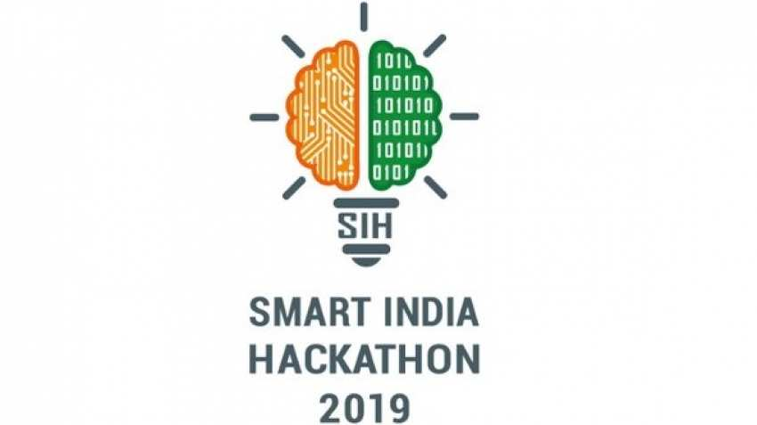

## Smart India Hackathon 2019

### This is a meta repository of SIH 2019.

### Problem Statement
There are at present about 44 labour laws for ensuring Decent Work in the country. Mostly, the labour laws are violated by employers to improve competitiveness. Regular / Complaint based Inspections or Self certification system have not been able to address the issue in a balanced way. MoLE has introduced Shram Suvidha Portal for inspection management. A technology based solution for improvement in labour-law compliance while ensuring minimum intrusion into the activities of business is needed.

### Prize Money- Rs. 1L (INR)

### Technology stack
    - ExpressJS for the frontend
    - AWS cloud for infrastructure
    - Serverless for backend APIs
    - AWS DynamoDB for the database

### Certificate- https://photos.app.goo.gl/svN6PZVEXQKxfNro8

### News Articles:
- https://kalingatv.com/state/kiit-students-win-smart-india-hackathon-2019/
- https://collegedunia.com/news/c-25760-kiit-students-win-smart-india-hackathon-2019
- https://www.youtube.com/watch?v=GPBOx3j3Nts